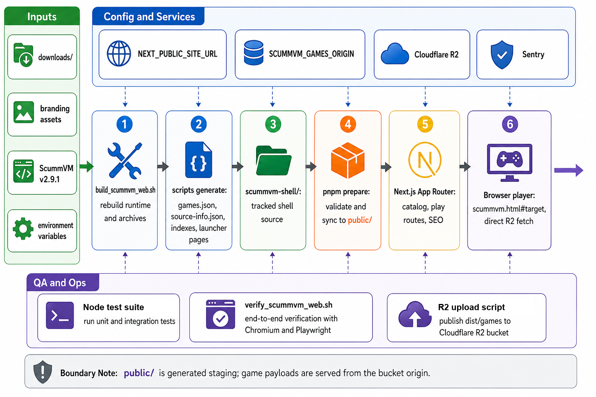

<div align="center">
  

  **🕹️ Classic point-and-click adventures, playable instantly in your browser 🕹️**

  [Live Demo](https://scummweb.tsilva.eu)
</div>

ScummWEB is a Next.js launcher for a curated ScummVM WebAssembly game collection. It builds static catalog pages, game detail pages, metadata routes, and a browser player that embeds the managed ScummVM shell.

The app keeps the deployable shell in this repo, while large game payloads are uploaded separately and fetched directly from a bucket origin in production.

## Install

```bash
git clone https://github.com/tsilva/scummweb.git
cd scummweb
pnpm install
pnpm run dev
```

Open [http://localhost:3000](http://localhost:3000).

## Commands

```bash
pnpm run dev             # validate/sync scummvm-shell/ into public/ and start Next.js
pnpm run build           # prepare managed shell assets and build production output
pnpm run start           # prepare managed shell assets and start the production server
pnpm run test            # run the Node test suite
pnpm run verify          # build, serve, and boot detected targets through Chromium
pnpm run build:scummvm   # rebuild the ScummVM WebAssembly shell and game metadata
pnpm run publish:games   # upload dist/games payloads to Cloudflare R2
pnpm run sentry:issues   # list recent Sentry issues from local env credentials
```

## Notes

- Use `pnpm`; `package.json` rejects other package managers during install.
- `scummvm-shell/` is the tracked source of truth for managed ScummVM shell assets.
- `public/` is generated staging. Do not hand-edit staged shell files when the source lives in `scummvm-shell/`.
- The playable baseline is Beneath a Steel Sky from `downloads/bass-cd-1.2.zip`, launched through `/scummvm.html#sky`.
- Production game payloads are served from `SCUMMVM_GAMES_ORIGIN`; localhost can use `/games-proxy/*` for verification.
- `pnpm run verify` runs `scripts/verify_scummvm_web.sh` and needs a local Chrome or Chromium install.
- `pnpm run build:scummvm` clones or reuses `vendor/scummvm` at ScummVM `v2.9.1`, applies local patches, regenerates `dist/`, and syncs the shell back into `scummvm-shell/`.
- R2 uploads require `AWS_ACCESS_KEY_ID`, `AWS_SECRET_ACCESS_KEY`, and the `SCUMMVM_R2_*` settings used by `scripts/upload_games_to_r2.py`.
- Sentry is optional. Runtime capture uses `NEXT_PUBLIC_SENTRY_DSN`, `SENTRY_DSN`, `NEXT_PUBLIC_SENTRY_ENABLED`, and the Sentry project settings in `next.config.js`.
- `NEXT_PUBLIC_SITE_URL` controls public metadata, sitemap, robots, and Open Graph URLs.

## Architecture



## License

No repository-level license file is currently included.
