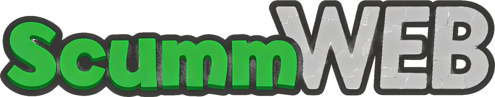

<div align="center">
  

  # ScummWEB

  Browser launcher for installed ScummVM web targets, packaged with ScummVM's upstream Emscripten build.

  Next.js app for serving a prebuilt ScummVM WebAssembly bundle and booting directly into detected launcher targets such as `sky`, `dreamweb`, `queen`, `lure`, `drascula`, `nippon-amiga`, and `sword25`.
</div>

## ✨ Features

- ScummVM-styled launcher UI that renders every detected ScummVM target from the generated bundle metadata
- Build pipeline that clones ScummVM, downloads the matching emsdk, and compiles a web target with the `sky`, `dreamweb`, `queen`, `lure`, `drascula`, `parallaction`, and `sword25` engines enabled
- Local game payload ingestion from `downloads/bass-cd-1.2.zip` plus optional `downloads/dreamweb*.zip`, `downloads/FOTAQ*.zip`, `downloads/lure*.zip`, `downloads/drascula*.zip`, `downloads/drascula-audio-2.0.zip`, `downloads/nippon-amiga*.zip`, and `downloads/sword25*.zip` archives into the generated browser bundle
- Production game delivery through Cloudflare R2 at `https://scummvm-games.tsilva.eu`, fetched directly by the browser with CORS enabled; the local app proxy remains available only for localhost verification
- Archive-based asset flow for the ScummVM shell only: generated non-game web files can be stored in `bundle/scummvm-public.zip` and restored into `public/` for local workflows
- Compliance surface that keeps `source.html`, `source-info.json`, bundled license texts, and bundled game readmes accessible from the launcher
- Playwright-based smoke verification that launches the Next.js app, checks the rendered launcher targets, and boots each detected ScummVM target
- App Router crawl metadata with `robots.txt` and a sitemap generated from `public/games.json`, so newly added game routes are included automatically

## 🏗️ How It Works

1. **Build ScummVM**: `scripts/build_bass_web.sh` clones `vendor/scummvm` if needed, installs the matching emsdk, and runs the upstream Emscripten build with the configured engines.
2. **Install Game Data**: The script unpacks `downloads/bass-cd-1.2.zip`, any matching `downloads/dreamweb*.zip`, `downloads/FOTAQ*.zip`, `downloads/lure*.zip`, `downloads/drascula*.zip`, `downloads/nippon-amiga*.zip`, and `downloads/sword25*.zip` archives into canonical `/games/<gameId>` folders inside ScummVM's web build directory. If `downloads/drascula-audio-2.0.zip` is present, it is overlaid into `/games/drascula/audio` so the official Drascula music tracks are available at runtime before ScummVM detects installed targets.
3. **Stamp Compliance Metadata**: `game.json`, `games.json`, `source-info.json`, and `source.html` are generated alongside ScummVM's bundled docs and runtime files.
4. **Upload Game Data**: `scripts/upload_games_to_r2.py` uploads the extracted game payload from `dist/games/` (or `public/games/` as a fallback) to R2, preserving the canonical `gameId`-backed directory layout behind the `scummvm-games.tsilva.eu` custom domain. It skips existing remote keys by default, supports `--force` to overwrite, can scope uploads to a single subdirectory-backed game with `--game`, and supports `--prune` to delete legacy remote keys that are no longer present locally.
5. **Serve the Launcher**: Next.js serves the launcher shell, and the ScummVM runtime mounts the `games` volume from the configured games origin. On localhost, the app keeps a small `/games-proxy/*` fallback so the verification script can run even when bucket CORS is scoped to production origins.

The launcher shell lives in [`app/page.js`](app/page.js), the CTA component lives in [`app/launch-button.js`](app/launch-button.js), and the heavy lifting for asset generation lives in [`scripts/build_bass_web.sh`](scripts/build_bass_web.sh) plus [`scripts/prepare_scummvm_bundle.sh`](scripts/prepare_scummvm_bundle.sh).

## 🚀 Getting Started

### Prerequisites

- macOS with `git`, `curl`, `python3`, `clang`, `make`, and `unzip`
- [Node.js](https://nodejs.org/) and npm for the Next.js shell
- `downloads/bass-cd-1.2.zip` present in this repo
- Optional DreamWeb archive copied into `downloads/` with a filename matching `dreamweb*.zip`
- Optional Flight of the Amazon Queen archive copied into `downloads/` with a filename matching `FOTAQ*.zip`
- Optional Lure of the Temptress archive copied into `downloads/` with a filename matching `lure*.zip`
- Optional Drascula archive copied into `downloads/` with a filename matching `drascula*.zip`
- Optional Drascula music addon copied into `downloads/drascula-audio-2.0.zip`
- Optional Nippon Safes, Inc. Amiga archive copied into `downloads/` with a filename matching `nippon-amiga*.zip`
- Optional Broken Sword 2.5 archive copied into `downloads/` with a filename matching `sword25*.zip`
- A local Chrome or Chromium install if you want to run the Playwright verification script

### Setup

```bash
git clone https://github.com/tsilva/scummvm-web.git
cd scummvm-web
npm install
./scripts/build_bass_web.sh
python3 ./scripts/upload_games_to_r2.py
npm run dev
```

Useful upload variants:

```bash
# Upload just one subdirectory-backed game target
python3 ./scripts/upload_games_to_r2.py --game queen
python3 ./scripts/upload_games_to_r2.py --game lure
python3 ./scripts/upload_games_to_r2.py --game drascula
python3 ./scripts/upload_games_to_r2.py --game nippon-amiga
python3 ./scripts/upload_games_to_r2.py --game sword25

# Re-upload everything and delete legacy remote keys
python3 ./scripts/upload_games_to_r2.py --force --prune
```

Open [http://localhost:3000](http://localhost:3000).

Run the main verification flow:

```bash
./scripts/verify_bass_web.sh
```

That script rebuilds the Next.js app, serves it locally on `127.0.0.1:3000`, launches Chromium through Playwright, verifies the launcher tiles, boots each detected target, and writes a screenshot to `artifacts/verify-launch.png`.

## ⚙️ Environment Variables

| Variable | Required | Description |
|----------|----------|-------------|
| `EMSDK_VERSION` | No | Overrides the emsdk version detected from ScummVM's upstream Emscripten build script during `scripts/build_bass_web.sh` |
| `AWS_ACCESS_KEY_ID` | Yes for R2 upload | R2 S3 access key used by `scripts/upload_games_to_r2.py`; the script reads it from the environment or `.env` |
| `AWS_SECRET_ACCESS_KEY` | Yes for R2 upload | R2 S3 secret key used by `scripts/upload_games_to_r2.py`; the script reads it from the environment or `.env` |
| `SCUMMVM_R2_BUCKET` | No | Overrides the default R2 bucket name (`scummvm-games`) for uploads |
| `SCUMMVM_R2_ENDPOINT` | No | Overrides the default R2 S3 endpoint for uploads |
| `SCUMMVM_GAMES_ORIGIN` | No | Overrides the default games origin (`https://scummvm-games.tsilva.eu`) used for generated readme links and the production browser filesystem mount |
| `SCUMMVM_GAMES_UPLOAD_DIR` | No | Overrides the upload source directory; defaults to `dist/games/`, then falls back to `public/games/` |
| `NEXT_PUBLIC_SITE_URL` | No | Overrides the default production site URL (`https://scummvm.tsilva.eu`) used for `metadataBase`, `robots.txt`, and `sitemap.xml` |

## ☁️ Deploy to Vercel

This repo deploys like a standard Next.js app once the ScummVM shell assets in `public/` are present and the game payload has been uploaded to R2. The launcher shell is deployed to Vercel, and the large game files stay in R2 behind the configured games origin, so they do not need to be bundled into the Vercel deployment.

The generated sitemap is based on the same `public/games.json` library that powers route generation, so adding a game through the existing metadata pipeline automatically adds its canonical route to `sitemap.xml` on the next build.

```bash
# Preview deployment
vercel deploy -y

# Production deployment
vercel deploy --prod -y
```

## 🛠️ Tech Stack

- [Next.js](https://nextjs.org/) 13.5
- [React](https://react.dev/) 18
- JavaScript with the App Router file layout
- [playwright-core](https://playwright.dev/)
- [ScummVM](https://www.scummvm.org/) 2.9.1
- [Emscripten](https://emscripten.org/)
- [Vercel](https://vercel.com/)

## 📁 Project Structure

```text
app/
├── layout.js
├── launch-button.js
├── globals.css
└── page.js
bundle/
└── scummvm-public.zip
downloads/
├── bass-cd-1.2.zip
├── dreamweb*.zip
├── FOTAQ*.zip
├── lure*.zip
├── drascula*.zip
├── drascula-audio-2.0.zip
├── nippon-amiga*.zip
└── sword25*.zip
scripts/
├── archive_scummvm_bundle.sh
├── build_bass_web.sh
├── prepare_scummvm_bundle.sh
├── upload_games_to_r2.py
├── verify_bass_web.sh
└── verify_game_launch.mjs
public/
├── game.json
├── games.json
├── source-info.json
├── source.html
└── scummvm.html
vendor/
└── scummvm/
```

## 📝 Notes

- `predev`, `prebuild`, and `prestart` can restore managed ScummVM shell assets from `bundle/scummvm-public.zip` for local workflows, but production game payloads are expected to come from R2.
- The launcher reads detected game entries from `public/games.json` and keeps `public/game.json` as the primary-entry fallback.
- `source-info.json` records the project and vendored ScummVM revisions used to generate the bundle, including dirty-worktree flags.
- Verification depends on a local Chrome or Chromium binary because the repo uses `playwright-core` rather than the full Playwright browser download.

## 📄 License

This repo does not currently ship a separate top-level license file. Runtime distribution materials expose the relevant upstream notices and source-offer documents through `public/doc/`, `public/source.html`, and game readmes served from the configured games origin.
